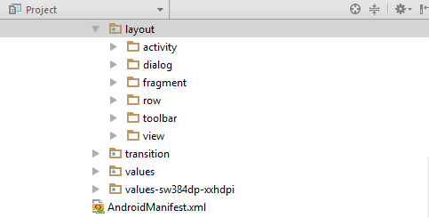

# Musicabinet client

Android client for https://www.musicabinet.com/

## Layout
Before start to work with this project recommend to install this plugin: https://github.com/dmytrodanylyk/folding-plugin

Before added new layout to project should append prefix to it.

**List of layout’s prefix:**
- activity (activity_login)
- dialog (dialog_loadin)
- fragment (fragment_card)
- item (item_transaction)
- toolbar (toolbar_card)
- view (view_counter)

## Libraries Used
* Picasso - https://github.com/square/picasso
* MkLoader - https://github.com/nntuyen/mkloader
* PageIndicatorView - https://github.com/romandanylyk/PageIndicatorView
* Retrofit - http://square.github.io/retrofit/
* RxJava - https://github.com/ReactiveX/RxJava
* RxAndroid - https://github.com/ReactiveX/RxAndroid
* Android Support Library - http://developer.android.com/tools/support-library/index.html
